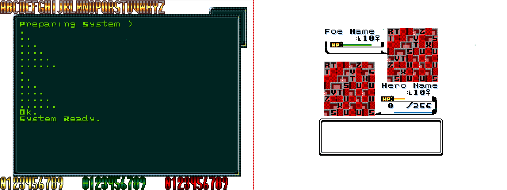

# MegaNgine


## Project Description
Generic Game Engine for the Mega Drive / Genesis written in **C** using the SGDK framework.

<!-- Live Demo: https://soundpanel.iskarion.ddns.net -->



## Install / Deploy Instructions
 1. Clone Repository
    ```bash
    git clone git@github.com:pinakure/MegaNgine.git /src/megangine
    ```
 2. Get up the container
    ```bash
    cd /src/megangine
    docker compose up --build -d
    ```
    
## Compiling the code
  1. Attach to container
     ```bash
     docker exec -it megangine bash
     ```
  2. Run compile script
     ```bash
     ./compile.sh
     ```
  The ROM file will be generated at **/src/megangine/out/ROM.bin**
     
## Updating the graphics
  1. Attach to container
     ```bash
     docker exec -it megangine bash
     ```
  2. Run update script
     ```bash
     ./update-gfx.sh
     ```
